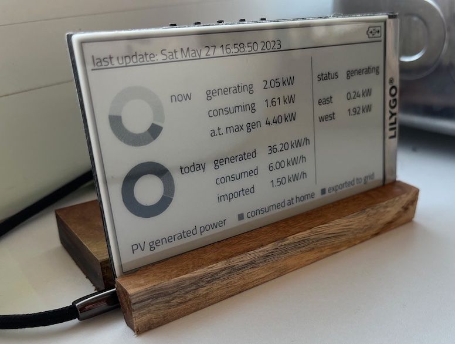

# SungrowEsp32Epaper (SH inverters)
Visualization of Sungrow PV converter data. Focus is on visualization of consumed PV power.

## Prepare Arduino IDE

### Download and install Arduino IDE
[download](https://docs.arduino.cc/software/ide-v2)

### Install ESP32 board
Arduino -> File -> Preferences -> Additional Boards Manager URLs -> https://raw.githubusercontent.com/espressif/arduino-esp32/gh-pages/package_esp32_index.json
Arduino -> Tools -> Board -> Board Manager -> esp32 (v 2.0.3 was used)

### Install LiliGo library
Download zip from https://github.com/Xinyuan-LilyGO/LilyGo-EPD47
-> https://github.com/Xinyuan-LilyGO/LilyGo-EPD47/archive/refs/heads/master.zip
Install it:
Arduino -> Sketch -> Include Library -> Add .ZIP Library -> select downlod from LiliGo library

### Install drivers for CH9102 USB to Serial chip
The ESP32 Lilygo uses a quite unknown USB to Serial chip, which may need drivers your OS does not have native. So if you have problems during the upload, this my be the solution.
This is documented [here](https://arduino.stackexchange.com/questions/88522/drivers-for-ch9102x-serial-port-chip)
e.g. MAC drivers can be downloaded [here](https://www.wch.cn/downloads/CH34XSER_MAC_ZIP.html)

## Configure Code
Open SgEsp32Epaper_cfg.h file in Arduino

### Wifi connection
Add your wifi credentials in DEFAULT_WLAN_SSID and DEFAULT_WLAN_PASSWORD

### Sungrow Modbus Address
Your converter shall be connected to your local network via RJ45 LAN cable. Use the RJ45 port from the converter. Add a static IP for this converter / MAC address in your router DHCP handling.
Configer MODBUS_SERVER_IP_1_OCT to MODBUS_SERVER_IP_4_OCT with respect to the DHCP settings you made.

## Bugfixes

## Hardware

### ESP32 Lilygo
You will need this hardware:
[The Lilygo ESP32 e-Paper display (PH 2.0 variant)](https://de.aliexpress.com/item/1005002006058892.html?spm=a2g0o.order_list.0.0.56495c5fTINk9D&gatewayAdapt=glo2deu). 
A battery is not mandatory as the hw is powered over USB. But in case you want to use it (temporary) without a USB connection, you will need something like this:
[Battery (example)](https://de.aliexpress.com/item/1005002919536938.html?spm=a2g0o.productlist.0.0.74036fa6idQD2W&ad_pvid=202205021227217858146889041840000671022_1&s=p) 

## Compile

- open the ino file
- make sure you selected the "ESP32 Dev Module" board in Skech > Tools > Board...
- set Skech > Tools > PSRAM to enabled
- connect the board to your computer
- select the new port in Sketch > Tools > Port...
- upload the file

